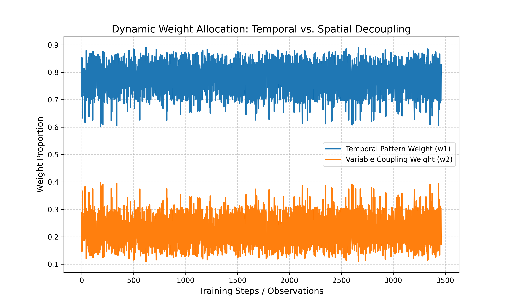

# Spatio-Temporal Decoupling for Multivariate Time Series Forecasting

本项目研究了多变量时间序列预测中的**时空解耦机制**。我们提出了一种通过正交软约束（Orthogonal Soft-Constraint）将潜在特征分解为“纯时间规律表征”与“变量耦合表征”的方法，在保证预测精度的同时，显著提升了模型的可解释性与内在解耦程度。

## 🚀 研究背景
在多变量时间序列预测中，现有的深度学习模型（如基准 GRU）往往将时间趋势与变量间的相关性混合建模（Entangled Modeling），这导致模型难以诊断预测结果是源于时间惯性还是变量交互。我们的研究通过显式解耦，赋予了模型诊断能力。

## 📊 核心可视化：动态权重分配
我们发现，模型并非静态地处理时序数据，而是根据序列特征动态调节权重。以下是模型在训练过程中对“时间规律（w1）”与“变量耦合（w2）”的动态权重分配趋势：


*从图中可以看出，模型能够自适应地平衡时间周期性与变量间的非线性相关性。*

## 📈 实验结论
在 `ETTh1` 数据集上的对比实验显示：

| 指标 | Baseline Model | Proposed Decoupling Model |
| :--- | :--- | :--- |
| **MSE** | 0.22936 | **0.22202** |
| **MAE** | 0.33701 | **0.33373** |
| **Cos_Sim²** | N/A | **0.00390** |

* **预测精度：** 我们的模型在 MSE 和 MAE 上均优于 Baseline，证明了显式解耦未破坏预测能力。
* **解耦程度：** 余弦相似度平方接近 0，验证了时空特征在潜空间内的正交性与独立性。
* **内在权重：** 模型自主学习的特征占比为：时间规律 (78.12%) vs. 变量耦合 (21.88%)。

## 🛠 使用方法
### 依赖安装
```bash
pip install torch pandas numpy matplotlib scikit-learn
